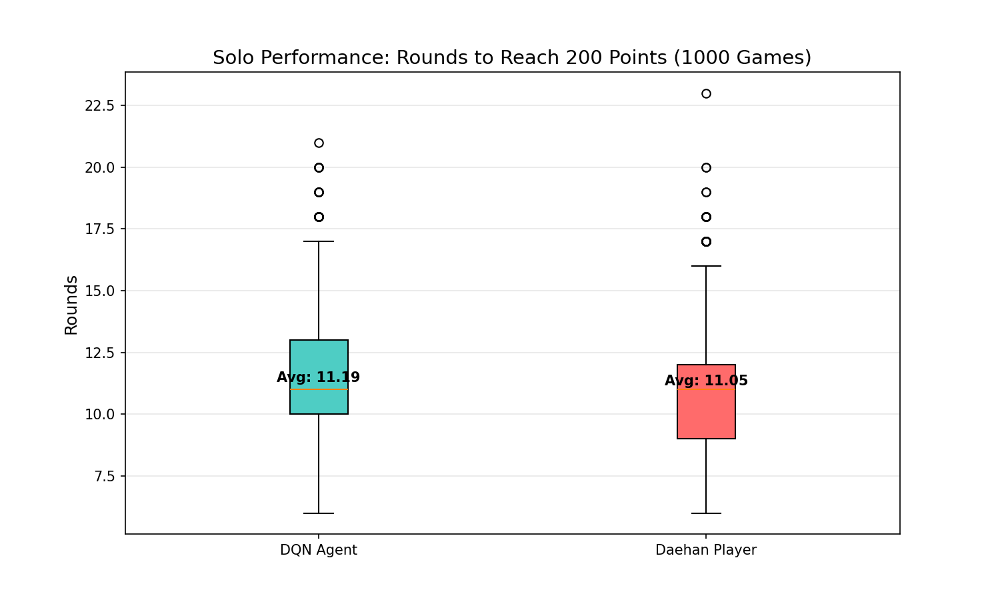
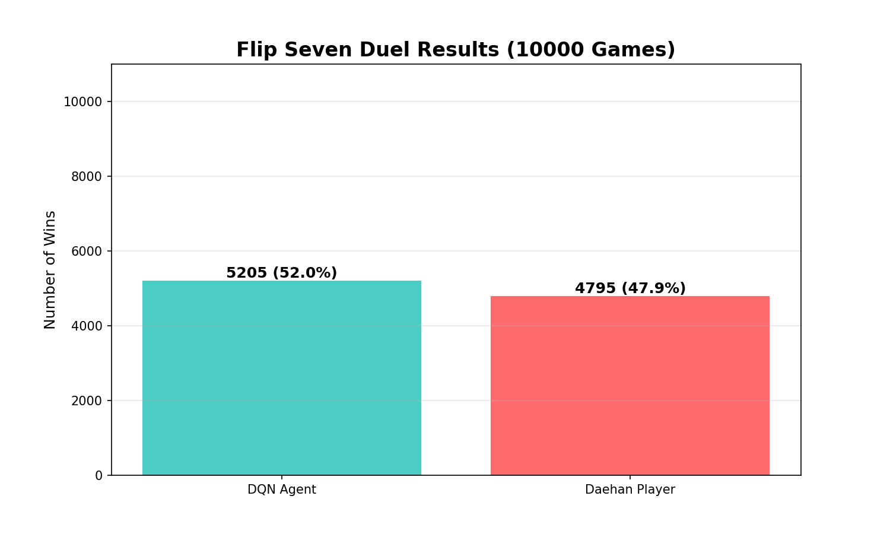
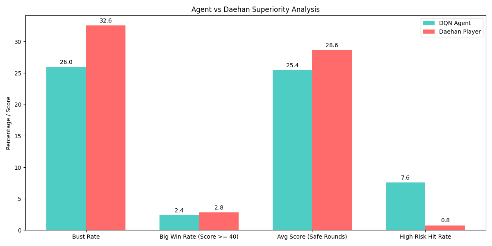
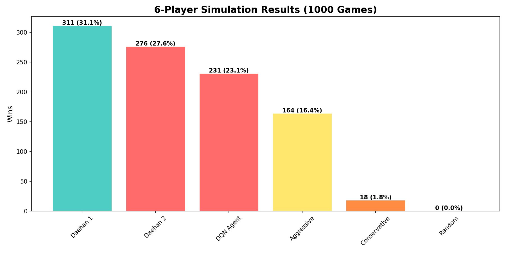
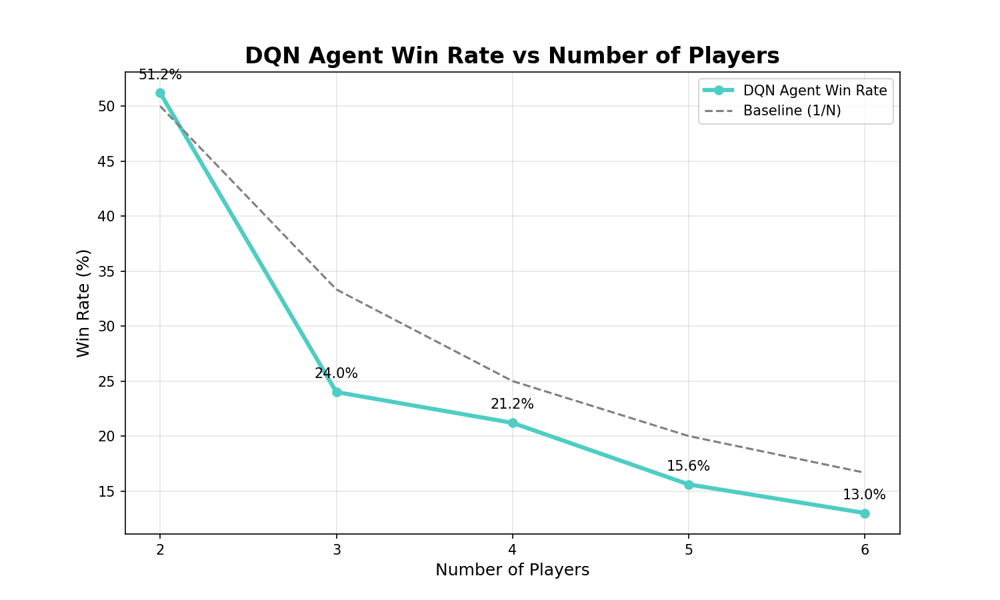
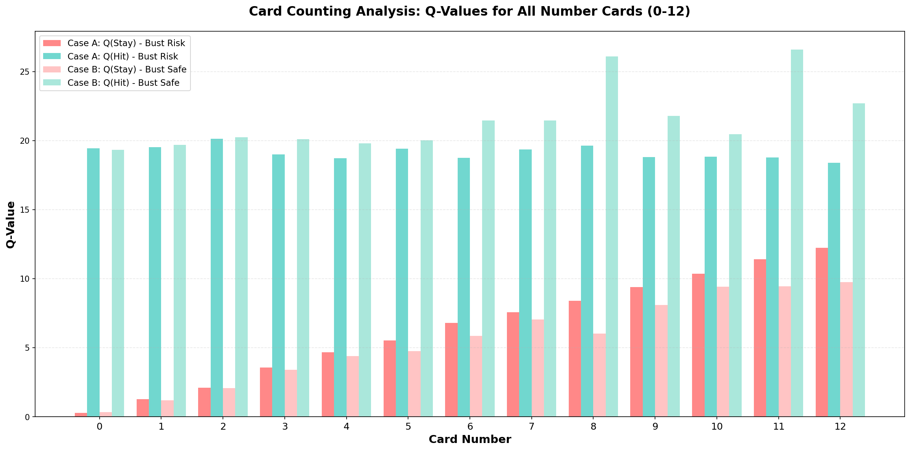
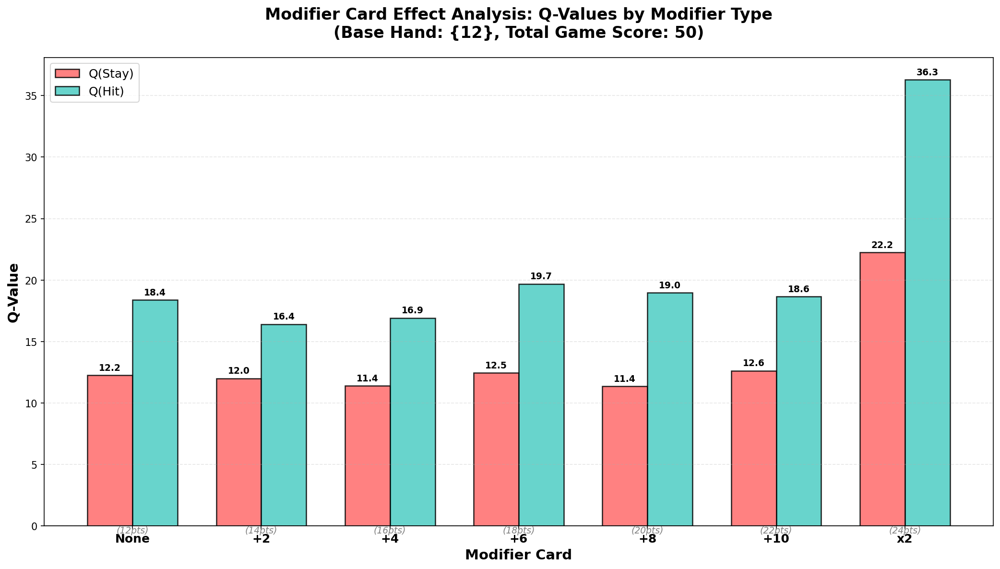
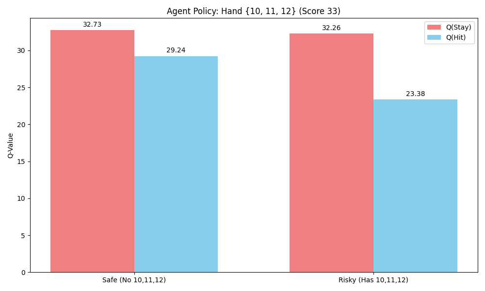

# Flip Seven 강화학습 (DQN) 프로젝트

이 프로젝트는 "Flip 7" 카드 게임을 플레이하는 AI 에이전트를 강화학습(Deep Q-Network)을 통해 개발하고, 합리적인 카드 카운팅 전략을 사용하는 'Daehan Player'와 비교 분석하는 연구 프로젝트입니다.

## 1. 프로젝트 개요

*   **목표** : Flip 7 게임에서 인간 수준 이상의 성능을 내는 AI 에이전트 개발
*   **핵심 알고리즘** : DQN (Deep Q-Network)
*   **환경** : Gymnasium 기반의 커스텀 `FlipSevenCoreEnv`
*   **성능 목표** : 200점에 도달하는 평균 라운드 수 최소화 (목표: 11라운드 이내)

## 2. 파일 구조 및 설명

이 프로젝트는 모듈화된 구조를 따르며, 모든 설정은 `config.py`에서 관리됩니다.

### 핵심 모듈
*   `config.py` : **[중요]** 프로젝트의 모든 설정(하이퍼파라미터, 파일 경로)을 관리하는 핵심 구성 파일입니다..
*   `flip_seven_env.py` : Flip 7 게임의 규칙과 로직을 구현한 Gymnasium 환경입니다.
*   `agent.py` : DQN 에이전트 클래스(`DQNAgent`)와 리플레이 버퍼(`ReplayBuffer`)가 정의되어 있습니다.
*   `network.py`: PyTorch 기반의 신경망 아키텍처(`QNetwork`)가 정의되어 있습니다.
*   `train.py` : 에이전트를 학습시키는 메인 스크립트입니다.

### 시뮬레이션 및 분석 스크립트
*   `analyze_superiority.py` : DQN 에이전트와 Daehan Player의 성능을 상세 지표(Bust Rate, Risk Taking 등)로 비교 분석합니다.
*   `simulate_duel.py` : 두 플레이어 간의 1:1 대결을 시뮬레이션하여 승률을 측정합니다.
*   `simulate_6players.py`: 6인 게임 환경(에이전트 1명 vs 5명)에서의 성능을 테스트합니다.
*   `simulate_player_scaling.py`: 플레이어 수(2~6명)에 따른 에이전트의 승률 변화를 분석합니다.
*   `simulate_solo.py`: 각 플레이어가 혼자 게임을 진행할 때 200점 도달 속도를 비교합니다.

### 기타
*   `runs/`: 학습 결과, 모델 체크포인트, 분석 그래프가 저장되는 디렉토리입니다.
    *   `latest_run/`: 가장 최근 실행의 결과물이 저장됩니다.
        *   `plots/`: 분석 결과 그래프 (`.png`)
        *   `checkpoints/`: 학습 중간 모델 저장
        *   `dqn_flip7_final.pth`: 최종 학습된 모델

## 3. 설치 및 실행 방법

### 필수 라이브러리 설치
```bash
pip install gymnasium numpy torch matplotlib pandas
```

### 학습 실행
```bash
python train.py
```
학습이 완료되면 모델은 `runs/latest_run/dqn_flip7_final.pth`에 저장됩니다.

### 성능 분석 실행
학습된 모델이 있는 상태에서 다음 스크립트들을 실행하여 성능을 분석할 수 있습니다.

```bash
# 0. environment 구현 확인
python test_env.py

# 1. DQN Agent와 Daehan Player가 각각 혼자서 게임을 진행할 때의 성능 분석
python simulate_solo.py

# 2. 1:1 대결 시뮬레이션
python simulate_duel.py

# 3. DQN Agent와 Daehan Player의 상세 우위 분석 (Bust Rate, Risk Taking 등)
python analyze_superiority.py

# 4. 6인 게임 시뮬레이션
python simulate_6players.py

# 5. 플레이어 수에 따른 성능 분석
python simulate_player_scaling.py

# 6. 교차 턴(Alternating Turns) 1:1 대결 시뮬레이션
python simulate_duel_alternately.py

# 7. 교차 턴(Alternating Turns) 6인 게임 시뮬레이션
python simulate_6players_alternately.py

# 7.1 시나리오 : card counting test
python test_policy_with_card_counting_test.py

# 7.2 시나리오 : modifier card test
python test_policy_with_modifier_card_effect.py

# 7.3 시나리오 : high risk test
python test_policy_with_12_11_10.py
```

## 4. 주요 실험 및 검증 결과
### 4.1 DQN Agent와 Daehan Player가 혼자서 플레이할 때, 200점 도달에 소요되는 라운드 수 비교
* **bash** : ```python simulate_solo.py```
* **설명** : Daehan Player는 카드 카운팅 전략을 기반으로, 확률적으로 최선의 선택을 합니다. DQN Agent는 학습된 Q-Value를 기반으로 결정합니다.
* **DQN Agent** : 11.19 라운드
* **Daehan Player** : 11.05 라운드
* **이미지 해석** : DQN Agent가 Daehan Player와 거의 동일한 성능을 보이고 있습니다.


### 4.2 DQN Agent와 Daehan Player가 같이 플레이할 때, 승률 비교
* **bash** : ```python simulate_duel.py```
* **설명** : DQN Agent와 Daehan Player가 같은 카드 덱을 공유하며 한 턴씩 번갈아가며 플레이합니다. 
* **이미지 해석** : DQN Agent가 Daehan Player보다 근소 우위의 승률을 보이는 것을 확인할 수 있습니다.


### 4.3 1:1에서 DQN Agent가 Daehan Player보다 근소 우위인 이유
* **bash** : ```python analyze_superiority.py```
* **설명** : DQN Agent가 Daehan Player보다 근소 우위의 승률을 보이는 이유를 분석합니다.
* **이미지 해석**
    * **안정성(Bust Rate)** : DQN Agent가 평소에는 더 안정적으로 플레이합니다. 
    * **대승 확률** : 한 라운드에서 40점 이상의 높은 점수를 획득하는 비율은 DQN Agent와 Daehan Player 모두 비슷합니다.
    * **AVG Score** : bust하지 않고 점수 획득에 성공한 라운드의 평균 점수는 Daehan Player가 더 높습니다. 
    * **위험 감수** : 승부처에는 DQN Agent가 거의 10배 과감합니다.
    * **결론** : DQN Agent가 Daehan Player보다 근소 우위의 승률을 보이는 이유는 DQN Agent가 Daehan Player보다 안정적으로 플레이하고, 승부처에는 거의 10배 과감함 때문입니다.



### 4.4 6인 게임에서의 DQN Agent와 Daehan Player의 승률 비교
* **bash** : ```python simulate_6players.py```
* **설명** : DQN Agent가 Daehan Player 2명과, 현재 라운드 점수가 30점 미만이면 무조건 Hit하는 Conservative Player, 현재 라운드 점수가 15점 이상이면 무조건 Stay하는 Conservative Player와 함께 플레이합니다. 
* **이미지 해석**
    * `Daehan 1`과 `Daehan 2`가 가장 높은 승률을 기록했습니다. 6인 게임에서는 덱이 매우 빠르게 소모되고 상황이 급변합니다. Daehan Player의 **카드 카운팅** 전략이 더욱 중요해졌습니다.
    * `DQN Agent`는 3위를 기록했습니다. Agent가 주로 1:1 상황이나 자신의 점수 극대화에 초점을 맞춰 학습했기 때문에, 6인 게임에서 성능이 떨어졌습니다. 
    * `Aggressive Player`가 `Conservative Player`보다 압도적으로 잘했습니다. 이는 어느 정도 위험을 감수하고 점수를 따내는 것이 승리에 필수적임을 의미합니다.  
    * **결론** : DQN Agent는 기본적인 플레이어들보다 훨씬 똑똑하지만, "6인 대난투" 같은 극한의 상황에서는 수학적 확률 계산을 따르는 기계적 전략이 아직은 조금 더 강력할 수 있음을 시사합니다.


### 4.5 인원 수에 따른 DQN Agent의 승률 변화
* **bash** : ```python simulate_player_scaling.py```
* **설명** : 플레이어 수(2~6명)에 따른 DQN Agent의 승률 변화를 분석합니다.
* **이미지 해석**
    1. **기준선(회색 점선)** 
        *  모든 플레이어의 실력이 똑같다고 가정했을 때의 기대 승률
        * 이 선보다 위에 있으면 "평균 이상", 아래에 있으면 "평균 이하"의 실력
    2. **DQN Agent(청록색 실선)**
        * **2인 게임 (51.2%)** : 기준선(50%)을 상회합니다.
        * **3~6인 게임** : 플레이어 수가 늘어날수록 승률이 기준선보다 아래로 떨어집니다.
    * **결론** : 에이전트는 1:1 승부에서는 합리적인 플레이어(Daehan Player)를 이길 수 있는 능력을 갖췄습니다. 하지만 플레이어 수가 늘어날수록 승률이 기준선보다 아래로 떨어집니다.
    이는 에이전트가 **내 턴이 다시 돌아오기 전에 덱이 얼마나 변할지** 예측하는 능력이 부족하다는 의미입니다.


### 4.6 DQN Agent의 카드 카운팅이 작동하고 있는지 확인
* **bash** : ```python test_policy_with_card_counting_test.py```
* **설명** : DQN Agent가 카드 카운팅 전략을 기반으로 플레이할 때의 성능을 분석합니다.
* **이미지 해석**
    * 모든 카드 번호(0~12)에서 **연한 청록색 막대(안전할 때의 Hit의 가치)**가 **진한 청록색 막대(위험할 때의 Hit의 가치)**보다 항상 더 높다.
    * 즉, DQN Agent는 **내 손에 있는 카드가 덱에 남아 있는지 없는지**를 정확히 인지하고 있다.


### 4.7 DQN Agent가 Modifier Card Effect를 적용할 때의 성능 분석
* **bash** : ```python test_policy_with_modifier_card_effect.py```
* **설명** : DQN Agent가 Modifier Card Effect를 적용할 때의 성능을 분석합니다.
* **이미지 해석**
    * 
        * **손에 카드 한 장(12)만 들고 있는, 저위험 상황**
        * 모든 수정자 카드에 대해, **청록색 막대(Hit)**가 **진한 청록색 막대(Stay)**보다 항상 더 높다.
        * 아직 점수가 낮고, bust 확률이 낮으므로 DQN Agent는 Hit를 하게 된다.
        * 특히, **x2 카드**가 있을 때 Q(Hit) 값이 폭발적으로 증가한 것은 DQN Agent가 **x2 카드**의 가치를 명확히 이해하고 있다는 뜻이다.
    * 
        * **손에 카드 한 장(9,10,11,12)만 들고 있는, 고위험 상황**
        * 모든 수정자 카드에 대해, **붉은색 막대(Stay)**가 **진한 청록색 막대(Hit)**보다 항상 더 높다.
        * 이미 고득점을 확보했으므로, DQN Agent는 Stay를 하게된다.
        * 여기서 **x2 카드**의 Q(Stay)가 압도적으로 높은 이유는, "42점을 지금 당장 84점으로 뻥튀기해서 확정 짓는 것"이 최고의 보상임을 정확히 인지하고 있기 때문이다.


### 4.8 DQN Agent의 손패가 {10, 11, 12}일 때, 위험 관리 능력 
* **bash** : ```python test_policy_with_12_11_10.py```
* **설명** : DQN Agent가 손패가 {10, 11, 12}일 때, 위험 관리 능력을 분석합니다.
* **이미지 해석**
    * 더 이상 덱에 {10, 11, 12}가 없을 때 Q(Hit)의 값이 덱에 {10, 11, 12}이 남아 있을 때 Q(Hit)의 값보다 훨씬 크다.
    * 하지만, 어느 경우에서든 Q(Stay)의 값이 더 크다.
    * Agent가 deck composition을 파악하고 있지만, 학습 과정에서 {10, 11, 12}가 핸드에 있을 때,
bust한 경험이 많아 Stay를 선택하는 것으로 추측한다.


