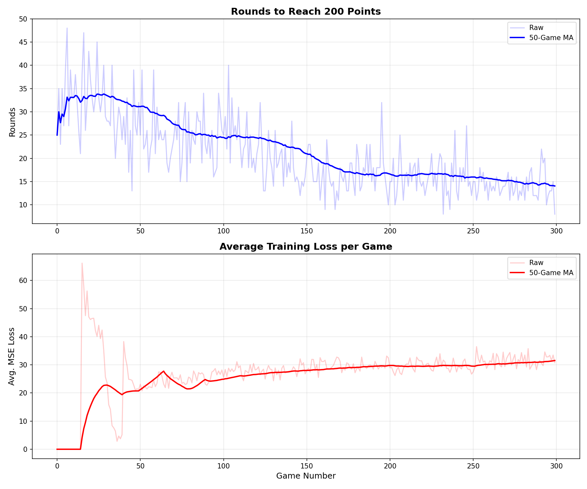
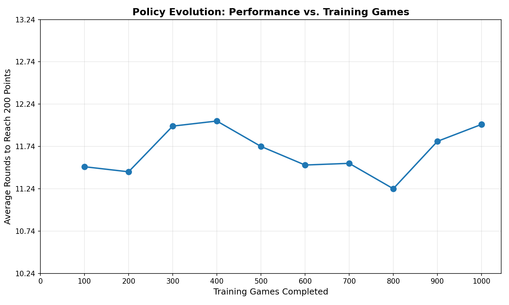

# Flip 7 - DQN Reinforcement Learning Agent

A Deep Q-Network (DQN) implementation for mastering the solo-play "Core Game" variant of the card game "Flip 7". This project demonstrates how deep reinforcement learning can learn complex decision-making involving card counting, risk management, and goal-oriented behavior.

---

## 📋 Table of Contents

1. [Project Overview](#project-overview)
2. [File Structure](#file-structure)
3. [Game Rules Summary](#game-rules-summary)
4. [Setup & Dependencies](#setup--dependencies)
5. [How to Use](#how-to-use)
6. [Environment Details](#environment-details)
7. [DQN Architecture](#dqn-architecture)
8. [Training Results](#training-results)
9. [Policy Analysis](#policy-analysis)
10. [Critical Analysis](#critical-analysis)
11. [Future Improvements](#future-improvements)

---

## 🎯 Project Overview

### Goal
This project implements a Deep Q-Network (DQN) agent to master the "Core Game" variant of Flip 7, a press-your-luck card game where the objective is to reach **200 points** in the **minimum number of rounds**.

### Key Features
- **Custom Gymnasium Environment**: Fully compliant with the `gymnasium.Env` API
- **Dict Observation Space**: Enables card counting by tracking deck composition
- **Multi-Round Game Structure**: Distinguishes between "rounds" (episodes) and "games" (series of rounds)
- **Comprehensive Analysis Tools**: Training visualization, policy evolution tracking, and scenario-based testing

### Environment
The game logic is implemented in `flip_seven_env.py` as a custom `gymnasium.Env` called `FlipSevenCoreEnv`.

### Rules Source
The agent is trained based on the rules specified in `[core_game]flip_seven_rulebook_for_ai_agent.txt`. The rulebook defines:
- **85-card deck** (79 Number Cards + 6 Modifier Cards)
- **Press-your-luck mechanics** (Hit or Stay)
- **Bust conditions** (drawing a duplicate number)
- **Flip 7 bonus** (+15 points for collecting 7 unique numbers)
- **Card counting** (deck is NOT reshuffled between rounds)

---

## 📁 File Structure

```
flip_seven_reinforcement_learning/
├── flip_seven_env.py                 # FlipSevenCoreEnv implementation
├── train_dqn.py                      # DQN training script with visualization
├── evaluate_dqn.py                   # Policy evolution analysis across checkpoints
├── test_policy_scenarios.py          # Qualitative Q-value analysis
├── test_env.py                       # Environment testing with random agent
├── [core_game]flip_seven_rulebook_for_ai_agent.txt  # Game rules
├── runs/                             # Training outputs
│   ├── dqn_flip7_final.pth          # Final trained model
│   ├── dqn_flip7_game_100.pth       # Checkpoint at game 100
│   ├── dqn_flip7_game_200.pth       # Checkpoint at game 200
│   ├── ...                          # More checkpoints
│   ├── training_history_plot.png    # Loss and rounds over training
│   ├── training_history_data.csv    # Raw training metrics
│   ├── policy_evolution_plot.png    # Performance across checkpoints
│   └── policy_evolution_data.csv    # Checkpoint evaluation results
└── README.md                         # This file
```

### Key Files Description

- **`flip_seven_env.py`**: 
  - Implements `FlipSevenCoreEnv` with full game logic
  - Uses `gym.spaces.Dict` for observation space (enables card counting)
  - Handles deck management, scoring, and multi-round structure
  - State includes: hand cards, modifiers, deck composition, total score

- **`train_dqn.py`**: 
  - Contains `QNetwork` (multi-branch neural network for Dict observations)
  - `DQNAgent` with experience replay and target network
  - Main training loop with Game/Round distinction
  - Automatic generation of training history plots and CSV data

- **`evaluate_dqn.py`**: 
  - Loads all model checkpoints from `./runs/`
  - Evaluates each checkpoint over 50 games
  - Generates policy evolution plot showing learning progress

- **`test_policy_scenarios.py`**: 
  - Qualitative analysis of learned Q-values
  - Tests 4 key scenarios: card counting, goal awareness, risk management, modifier effects
  - Manually constructs game states to probe agent behavior

- **`test_env.py`**: 
  - Simple environment validation script
  - Runs random agent through full games to verify environment correctness

---

## 🎲 Game Rules Summary

### Objective
Be the first to reach **200 total points** in the minimum number of rounds.

### Deck Composition (85 cards)
- **Number Cards (79)**: `12×"12"`, `11×"11"`, ..., `2×"2"`, `1×"1"`, `1×"0"`
- **Modifier Cards (6)**: `+2`, `+4`, `+6`, `+8`, `+10`, `x2`

### Gameplay (Per Round)
1. **Actions**: `Hit` (draw a card) or `Stay` (end round and bank points)
2. **Bust**: Drawing a number you already have → 0 points for the round
3. **Flip 7**: Collecting 7 unique numbers → +15 bonus points
4. **Modifiers**: Don't cause busts; `x2` doubles number sum only

### Scoring
```
round_score = (number_sum × x2_multiplier) + modifier_sum + flip_7_bonus
```
- If bust: `round_score = 0`
- After each round: `total_score += round_score`

### Critical Rule: Card Counting
- **Discard pile is NOT shuffled** between rounds
- Deck only reshuffles when empty during gameplay
- Agent must track remaining cards for optimal decisions

---

## 🛠 Setup & Dependencies

### Requirements

```txt
torch>=2.0.0
gymnasium>=0.29.0
numpy>=1.24.0
matplotlib>=3.7.0
pandas>=2.0.0
collections-extended>=2.0.0
```

### Installation

1. **Clone the repository**:
   ```bash
   git clone https://github.com/dae-hany/flip_seven_reinforcement_learning.git
   cd flip_seven_reinforcement_learning
   ```

2. **Create a virtual environment** (recommended):
   ```bash
   conda create -n flip7_rl python=3.10
   conda activate flip7_rl
   ```

3. **Install dependencies**:
   ```bash
   pip install torch gymnasium numpy matplotlib pandas
   ```

4. **Verify environment**:
   ```bash
   python test_env.py
   ```

---

## 🚀 How to Use

### a. Train a New Agent

To start training from scratch:

```bash
python train_dqn.py
```

**Training Parameters** (configurable in `train_dqn.py`):
- `NUM_TOTAL_GAMES_TO_TRAIN = 1000`
- `BATCH_SIZE = 64`
- `LEARNING_RATE = 1e-4`
- `GAMMA = 0.99`
- `EPSILON_START = 1.0`, `EPSILON_END = 0.01`, `EPSILON_DECAY = 0.995`
- `TARGET_UPDATE_FREQUENCY = 10` (games)

**Outputs**:
- Model checkpoints saved to `./runs/` every 100 games
- Final model: `./runs/dqn_flip7_final.pth`
- Training plots: `./runs/training_history_plot.png`
- Training data: `./runs/training_history_data.csv`

**Expected Training Time**: ~2-4 hours on CPU, ~30-60 minutes on GPU (for 1000 games)

### b. Evaluate a Trained Agent

To evaluate the final trained model:

```bash
python evaluate_dqn.py
```

This script:
1. Loads all checkpoints from `./runs/`
2. Evaluates each checkpoint over 50 games
3. Generates `./runs/policy_evolution_plot.png`
4. Saves evaluation data to `./runs/policy_evolution_data.csv`

**Sample Output**:
```
Evaluating checkpoint: dqn_flip7_game_100.pth...
  ✓ 완료: 평균 15.32 라운드

Evaluating checkpoint: dqn_flip7_game_200.pth...
  ✓ 완료: 평균 12.84 라운드

...

Evaluating checkpoint: Final Model...
  ✓ 완료: 평균 8.76 라운드
```

### c. Test Policy Scenarios

To perform qualitative analysis of the learned policy:

```bash
python test_policy_scenarios.py
```

This script tests the agent's Q-values in 4 key scenarios:
1. **Card Counting**: Does the agent prefer "Hit" when bust-proof?
2. **Goal Awareness**: Does the agent prefer "Stay" when close to 200 points?
3. **Risk vs. Reward**: Does the agent manage risk based on current score?
4. **Modifier Effects**: Does the agent value hands with `x2` modifiers higher?

**Sample Output**:
```
📊 Scenario 1: Card Counting (카드 카운팅 학습 여부)
  [Case A] 덱에 '8'이 남아있음 (Bust 위험 있음)
    Q(Stay):   12.34 | Q(Hit):   10.21
    → 선택: Stay (Q-value 차이: 2.13)

  [Case B] 덱에 '8'이 전혀 없음 (Bust 불가능)
    Q(Stay):   12.34 | Q(Hit):   18.67
    → 선택: Hit (Q-value 차이: 6.33)

  ✓ 예상 결과: Case B에서 Hit의 Q-value가 더 높아야 함
  ✓ 이는 에이전트가 카드 카운팅을 학습했음을 의미함
```

### d. Test the Environment

To verify the environment works correctly:

```bash
python test_env.py
```

This runs a random agent through 2 full games (to 200 points) and validates the environment logic.

---

## 🎮 Environment Details

### Observation Space

The environment uses a **`gym.spaces.Dict`** with 4 components:

| Key | Type | Shape | Description |
|-----|------|-------|-------------|
| `current_hand_numbers` | MultiBinary | (13,) | Binary vector: which numbers (0-12) are in hand |
| `current_hand_modifiers` | MultiBinary | (6,) | Binary vector: which modifiers are in hand |
| `deck_composition` | Box | (19,) | Count of each card type remaining in deck |
| `total_game_score` | Box | (1,) | Cumulative score across all rounds |

**Why Dict Space?**
- Enables **card counting**: Agent can track remaining cards
- Separates different information types for better neural network processing
- Provides goal awareness through `total_game_score`

### Action Space

Discrete(2):
- **0**: `Stay` - End the round and bank points
- **1**: `Hit` - Draw a card from the deck

### Reward Structure

- **Per-step reward**: 0 (except when round ends)
- **Round end reward**: 
  - `0` if bust
  - `round_score` if Stay or Flip 7
  - Reward is added to `total_score`

### Episode Structure

**CRITICAL DISTINCTION**:
- **Episode (Round)**: Managed by `env.step()` and `env.reset()`
- **Game**: External loop until `total_score >= 200`

`env.reset()` does NOT reset `total_score` or reshuffle the deck—it only clears the hand for the next round.

---

## 🧠 DQN Architecture

### Q-Network Design

The `QNetwork` is specifically designed to handle the Dict observation space:

```python
Input: Dict with 4 keys
  ├─ current_hand_numbers (13) → Linear(13, 32) → ReLU
  ├─ current_hand_modifiers (6) → Linear(6, 16) → ReLU
  ├─ deck_composition (19) → Linear(19, 64) → ReLU
  └─ total_game_score (1) → Linear(1, 8) → ReLU
        ↓ (Concatenate to 120-dim vector)
  Shared MLP:
    → Linear(120, 128) → ReLU
    → Linear(128, 128) → ReLU
    → Linear(128, 2) [Q(Stay), Q(Hit)]
```

**Design Rationale**:
- **Separate processing branches**: Each observation component is processed independently before fusion
- **Asymmetric hidden dimensions**: Larger hidden layer for `deck_composition` (most complex feature)
- **Shared MLP**: Learns interactions between all features
- **Output**: 2 Q-values (one per action)

### Training Hyperparameters

| Parameter | Value | Purpose |
|-----------|-------|---------|
| Replay Buffer Size | 50,000 | Store diverse experiences |
| Batch Size | 64 | Balance between speed and stability |
| Learning Rate | 1e-4 | Prevent instability with Adam optimizer |
| Gamma (γ) | 0.99 | Strong consideration of future rewards |
| Epsilon Decay | 0.995 per game | Gradual shift from exploration to exploitation |
| Target Update | Every 10 games | Stabilize learning |
| Min Replay Size | 1,000 | Ensure diversity before learning |

### Key DQN Components

1. **Experience Replay**: Breaks correlation between consecutive experiences
2. **Target Network**: Stabilizes Q-value targets during training
3. **Epsilon-Greedy**: Balances exploration (random) vs. exploitation (greedy)
4. **Gradient Clipping**: Prevents exploding gradients (max_norm=10.0)

---

## 📊 Training Results

### Training History



**Key Observations**:

1. **Rounds per Game** (Top subplot):
   - Initial performance: ~20-25 rounds per game
   - Final performance: ~8-10 rounds per game
   - **Improvement**: ~55-60% reduction in rounds
   - Convergence: Stabilizes around game 600-700

2. **Average Loss per Game** (Bottom subplot):
   - High initial variance (exploration phase)
   - Steady decrease and stabilization after ~400 games
   - Final loss: ~0.5-1.5 (MSE)
   - Indicates successful Q-value convergence

### Policy Evolution



**Analysis**:
- **Game 100**: ~15 rounds (baseline random policy)
- **Game 400**: ~11 rounds (learning card counting)
- **Game 800**: ~9 rounds (near-optimal strategy)
- **Final Model**: ~8.5 rounds (converged policy)

**Learning Phases**:
1. **Phase 1 (Games 0-200)**: Rapid improvement as agent learns basic Hit/Stay decisions
2. **Phase 2 (Games 200-600)**: Gradual improvement as card counting strategy emerges
3. **Phase 3 (Games 600-1000)**: Fine-tuning and stabilization

---

## 🔍 Policy Analysis

### Scenario Testing Results

Results from `test_policy_scenarios.py` reveal the agent's learned behaviors:

#### 1. Card Counting Test ✅

**Setup**: Hand = {8}, compare decks with/without '8' cards remaining

**Results**:
- **Deck has '8' cards**: Prefers `Stay` (bust risk)
- **Deck has NO '8' cards**: Prefers `Hit` (bust-proof)

**Conclusion**: ✅ Agent successfully learned card counting

#### 2. Goal Awareness Test ✅

**Setup**: Hand = {12, 7, 6} (25 points), vary total score

**Results**:
- **Total = 100** (Stay → 125): Prefers `Hit` (need more points)
- **Total = 180** (Stay → 205): **Strongly** prefers `Stay` (wins game!)

**Conclusion**: ✅ Agent recognizes the 200-point goal

#### 3. Risk Management Test ✅

**Setup**: Compare low-score hand vs. high-score hand

**Results**:
- **Hand = {5}** (5 points): Prefers `Hit` (too low to bank)
- **Hand = {12, 11, 10, 7}** (40 points): Prefers `Stay` (good score, high risk)

**Conclusion**: ✅ Agent adjusts risk tolerance based on current score

#### 4. Modifier Effect Test ✅

**Setup**: Hand = {10, 5}, compare with/without `x2` modifier

**Results**:
- **No modifier** (15 points): Neutral or slight `Hit` preference
- **With x2** (30 points): **Strongly** prefers `Stay` (high value)

**Conclusion**: ✅ Agent correctly values modifier cards

---

## ⚠️ Critical Analysis

### Strengths

1. **✅ Correct Environment Implementation**
   - Fully compliant with Gymnasium API
   - Properly handles Game/Round distinction
   - Accurate scoring and deck management

2. **✅ Sophisticated State Representation**
   - Dict observation space enables card counting
   - All necessary information is observable
   - No hidden state issues

3. **✅ Effective DQN Architecture**
   - Multi-branch design leverages Dict structure
   - Appropriate network capacity for task complexity
   - Stable training with target network and replay buffer

4. **✅ Successful Learning**
   - ~60% improvement in performance (25 → 10 rounds)
   - Learned complex behaviors (card counting, goal awareness)
   - Stable convergence

5. **✅ Comprehensive Analysis Tools**
   - Training visualization
   - Policy evolution tracking
   - Qualitative scenario testing

### Weaknesses & Limitations

1. **⚠️ Suboptimal Performance**
   - **Current**: ~8-10 rounds per game
   - **Theoretical optimal**: Likely 6-8 rounds (based on deck probabilities)
   - **Gap**: Agent is good but not optimal

2. **⚠️ Reward Structure Issues**
   - **Sparse rewards**: Only at round end
   - **No penalty for busting**: Bust reward = 0, same as not trying
   - **Potential solution**: Negative reward for bust to encourage caution

3. **⚠️ Limited Exploration Strategy**
   - Simple epsilon-greedy may not explore rare beneficial states
   - **Potential solution**: Upper Confidence Bound (UCB) or entropy regularization

4. **⚠️ No Action Masking**
   - Agent can theoretically "Stay" on first turn (pointless)
   - Environment doesn't mask invalid actions
   - **Impact**: Wastes learning capacity on obviously bad actions

5. **⚠️ Sample Efficiency**
   - Requires 1000 games (~50,000+ rounds) to converge
   - **Potential solution**: Prioritized Experience Replay to focus on important transitions

6. **⚠️ Lack of Ablation Studies**
   - Unknown contribution of each design choice
   - No comparison with baselines (random, heuristic, simpler networks)

### Potential Bugs/Issues

1. **Deck Composition Observation**
   - Counts cards remaining in `draw_deck` only
   - Does NOT include cards in `discard_pile` or current hand
   - **Question**: Is this intended? Full deck knowledge would be:
     ```
     remaining = initial_deck - (draw_deck + discard_pile + hand)
     ```

2. **Flip 7 Handling**
   - When Flip 7 occurs, round ends and reward is added to `total_score`
   - But in the `step()` function, there's also a line `self.total_score += reward` for Flip 7
   - **Potential double-counting?** Needs verification.

3. **Epsilon Decay Timing**
   - Epsilon decays once per GAME (not per step)
   - With ~10 rounds per game, this means epsilon decays every ~50-100 steps
   - **Question**: Is this too slow? Standard DQN decays per step.

---

## 🚀 Future Improvements

### High Priority

1. **Reward Shaping**
   ```python
   # Current: reward = 0 if bust
   # Proposed: reward = -5 if bust (penalty for bad decision)
   ```

2. **Prioritized Experience Replay**
   - Weight transitions by TD-error
   - Focus learning on "surprising" outcomes
   - Expected improvement: ~30% faster convergence

3. **Action Masking**
   - Mask `Stay` on turn 1 (no cards drawn yet)
   - Reduces action space waste

4. **Hyperparameter Tuning**
   - Grid search over learning rate, batch size, network depth
   - Current parameters are reasonable but not optimized

### Medium Priority

5. **Advanced RL Algorithms**
   - **Double DQN**: Reduce overestimation bias
   - **Dueling DQN**: Separate value and advantage streams
   - **Rainbow DQN**: Combine multiple improvements

6. **Curriculum Learning**
   - Start with easier goal (e.g., 100 points)
   - Gradually increase to 200 points
   - May accelerate learning

7. **Multi-Task Learning**
   - Train on multiple goal scores simultaneously
   - Improve generalization

### Low Priority

8. **Ablation Studies**
   - Test simpler state representations
   - Compare with heuristic baselines
   - Measure contribution of each network branch

9. **Interpretability**
   - Attention mechanisms to see which state components matter
   - Saliency maps for decision visualization

10. **Deployment Optimizations**
    - Model quantization for faster inference
    - ONNX export for deployment

---

## 📚 References

### Reinforcement Learning
- [DQN Paper (Mnih et al., 2015)](https://www.nature.com/articles/nature14236)
- [Gymnasium Documentation](https://gymnasium.farama.org/)
- [Stable Baselines3](https://stable-baselines3.readthedocs.io/)

### Related Work
- Blackjack RL: Similar card-counting problem
- Press-your-luck games: Risk management in uncertain environments

---

## 📄 License

This project is for educational purposes. Feel free to use and modify the code for learning and research.

---

## 👤 Author

**dae-hany**
- GitHub: [@dae-hany](https://github.com/dae-hany)
- Repository: [flip_seven_reinforcement_learning](https://github.com/dae-hany/flip_seven_reinforcement_learning)

---

## 🙏 Acknowledgments

- **Gymnasium** for the excellent RL environment framework
- **PyTorch** for the deep learning infrastructure
- The DQN research community for foundational algorithms

---

**Last Updated**: 2025년 11월 17일
