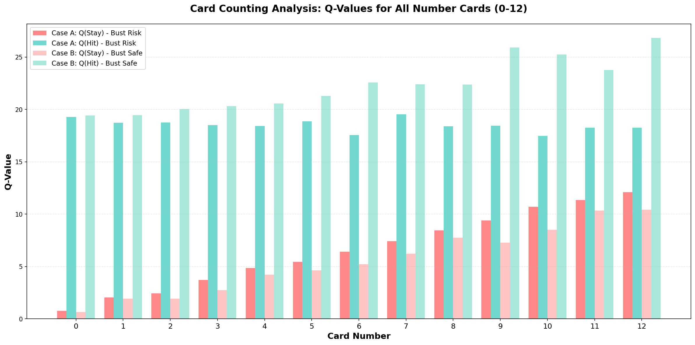
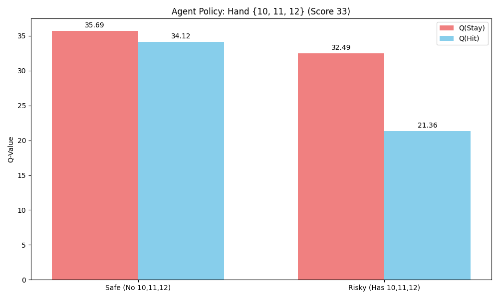
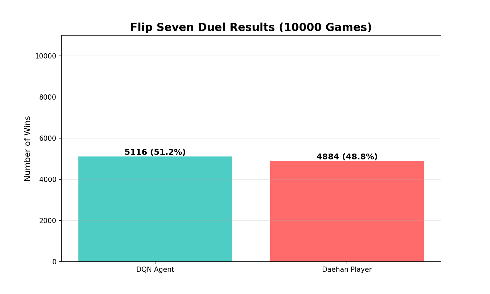
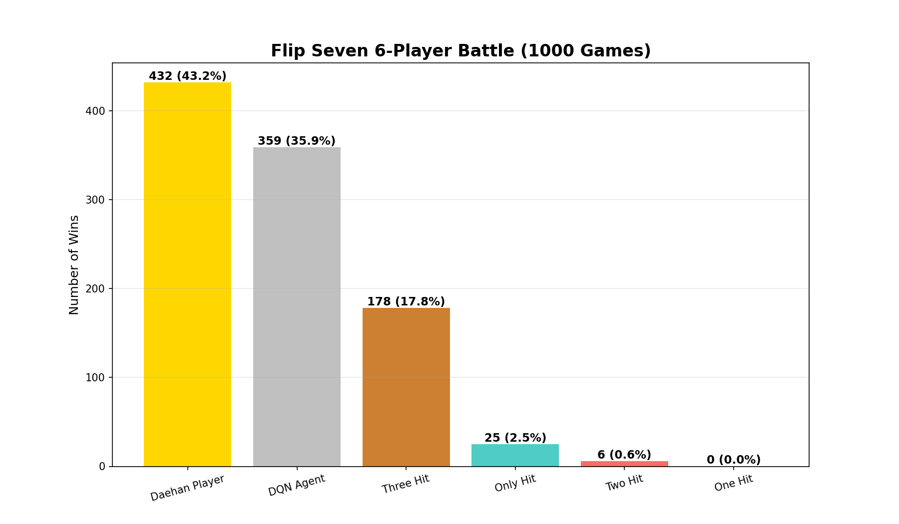

# Flip Seven Reinforcement Learning Project

이 프로젝트는 보드게임 **"Flip Seven"**을 플레이하는 AI 에이전트를 **강화학습(Deep Q-Network, DQN)**을 통해 학습시키고, 그 성능을 다양한 방식으로 검증한 연구 프로젝트입니다.

## 1. 프로젝트 개요
**Flip Seven**은 카드를 뽑아 점수를 모으는 "Press Your Luck" 장르의 카드 게임입니다. 플레이어는 언제 멈출지(Stay) 또는 계속 뽑을지(Hit)를 결정해야 하며, 같은 숫자가 나오면 점수를 잃는(Bust) 위험이 있습니다.

이 프로젝트의 목표는 **"카드 카운팅(Card Counting)"**과 **"위험 관리(Risk Management)"**를 스스로 학습하여 인간 고수 수준의 플레이를 펼치는 AI를 만드는 것입니다.

---

## 2. 강화학습 환경 (Environment)
OpenAI Gymnasium 인터페이스를 기반으로 `FlipSevenCoreEnv`를 직접 구현했습니다.

### 관측 공간 (Observation Space)
에이전트는 다음 정보를 보고 판단합니다:
1.  **내 손패 (Hand)**: 현재 가지고 있는 숫자 카드와 특수 카드(Modifier)
2.  **덱 구성 (Deck Composition)**: **(핵심)** 남은 덱에 어떤 카드가 몇 장 있는지 (카드 카운팅 정보)
3.  **현재 점수 (Score)**: 현재 라운드의 획득 점수

### 행동 공간 (Action Space)
*   **0 (Stay)**: 현재 점수를 확정 짓고 라운드 종료
*   **1 (Hit)**: 카드 한 장 더 뽑기 (Bust 위험 감수)

### 보상 (Reward)
*   **Linear Reward**: 획득한 점수 그대로를 보상으로 지급 (최종 채택)
*   *Non-linear Reward*: 점수의 제곱 등을 시도했으나, Linear 방식이 학습 안정성이 더 높음

---

## 3. 알고리즘 (DQN)
*   **모델 구조**: 상태(State)를 입력받아 각 행동(Hit/Stay)의 가치(Q-Value)를 출력하는 신경망
*   **고급 기법**:
    *   **Replay Buffer**: 과거 경험을 저장해두고 무작위로 추출하여 학습 (데이터 상관관계 제거)
    *   **Target Network**: 학습 목표가 되는 네트워크를 천천히 업데이트하여 학습 안정화
    *   *(실험적 시도)* Double DQN, Dueling Network도 구현하여 비교했으나, 본 게임에서는 기본 DQN으로도 충분한 성능을 보여 기본 모델을 채택함

---

## 4. 주요 실험 및 검증 결과

### ① 카드 카운팅 능력 검증
에이전트가 단순히 "내 점수"만 보는 것이 아니라, **"남은 덱의 상황"**을 보고 판단하는지 테스트했습니다.
*   **실험**: 내 손에 `7`이 있을 때, 덱에 `7`이 **있는 경우(위험)**와 **없는 경우(안전)**의 Q-Value 비교
*   **결과**: 모든 숫자 카드(0~12)에 대해, **안전한 상황일 때 Hit의 가치를 훨씬 높게 평가**했습니다.
*   **결론**: 에이전트는 **완벽한 카드 카운팅 능력**을 학습했습니다.
    *   

### ② 고위험 시나리오 테스트 (Hand: 12, 11, 10)
*   **상황**: 손패에 `12, 11, 10`이 있어 Bust 확률이 매우 높은 상황
*   **결과**: 덱에 `12, 11, 10`이 하나도 없는 **안전한 상황(Safe Case)**임을 인지하자, Hit에 대한 선호도(Q-Value)가 급격히 상승했습니다. (비록 33점이라 Stay를 택했지만, 판단의 근거는 명확했습니다.)
    *   

### ③ 1:1 대결 시뮬레이션 (vs Daehan Player)
*   **상대**: **Daehan Player** (수학적으로 기대값(EV)을 계산하여 플레이하는 **이론상 최적의 봇**)
*   **결과 (10,000판)**:
    *   **DQN Agent 승률**: **51.2%**
    *   **Daehan Player 승률**: 48.8%
*   **의미**: 수학적 계산기인 봇과 대등하거나 근소하게 우위인 실력을 보여주었습니다. 이는 AI가 **"합리적 판단"**의 경지에 도달했음을 의미합니다.
    *   

### ④ 다인전 (6인) 시뮬레이션
*   **상황**: 6명의 플레이어가 하나의 덱을 공유 (덱 소모 속도가 매우 빠름)
*   **참가자**: Agent, Daehan, 그리고 단순 전략 봇들(Always Hit, One Hit 등)
*   **결과**:
    *   **1위**: Daehan Player (43.2%)
    *   **2위**: DQN Agent (35.9%)
    *   나머지 봇들은 처참한 승률 기록
*   **의미**: 변수가 많은 다인전에서도 Agent는 상위권을 유지하며 **"판을 지배하는 플레이어"**임을 입증했습니다.
    *   

---

## 5. 설치 및 실행 방법

### 필수 라이브러리 설치
```bash
pip install gymnasium torch numpy matplotlib pandas
```

### 주요 스크립트 실행
1.  **에이전트 학습**:
    ```bash
    python train.py
    ```
2.  **카드 카운팅 검증**:
    ```bash
    python test_policy_with_card_counting_test.py
    ```
3.  **1:1 대결 시뮬레이션**:
    ```bash
    python simulate_duel.py
    ```
4.  **6인 대결 시뮬레이션**:
    ```bash
    python simulate_6players.py
    ```
5.  **플레이어 수에 따른 승률 분석**:
    ```bash
    python simulate_player_scaling.py
    ```

---

## 6. 결론
이 프로젝트를 통해 **강화학습 에이전트가 복잡한 카드 게임의 규칙을 스스로 터득하고, 고도의 전략인 카드 카운팅까지 구사할 수 있음**을 확인했습니다. 특히 수학적으로 설계된 알고리즘 봇과 대등한 승부를 펼친 것은 매우 고무적인 성과입니다.
